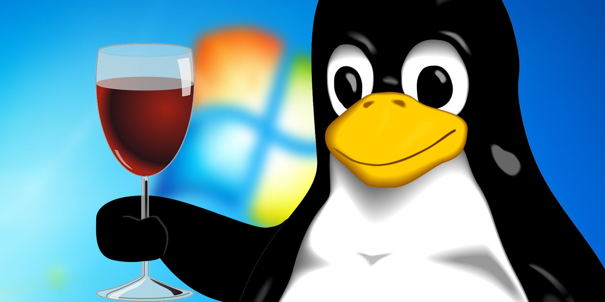

# Olá, meu nome é Ryan Richarlison.

**Minhas linguaguens preferidas são**
- Python3
- Javascript
- PHP
- CSS3 + HTML5

Sou **Fullstack** e **GameDev**.
Estudo **redes wireless** e **segurança da informação**.

Atualmente ultilizo [Debian](https://debian.org/) e [Linux Mint](https://linuxmint.com).

E ultilizo a engine [Godot](https://godotengine.org/) para desenvolvimento de jogos.

**Fim do documento.**
